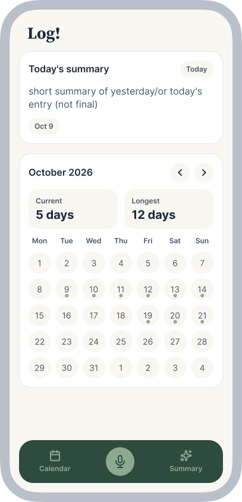
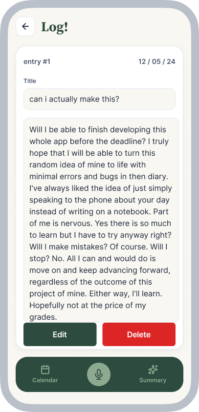
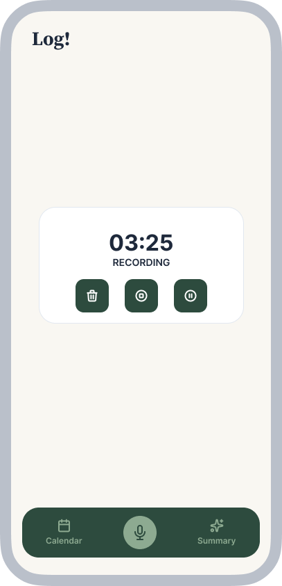

# Log!

> Your personal virtual voice diary; for anyone who can't be bothered to write or type it.

**Live demo:** https://drain18.github.io/Log/
**Demo video:** `docs/demo.mp4` (link it here once it exists)
**Course:** Applications Development and Emerging Technologies (6ADET), Holy Angel University
**Author:** drain18

---

## Screenshots

| Home | Reading your Entry | Add an Entry |
| --- | --- | --- |
|  |  |  |

## What it does

- View your current journal entries with a streak counter on an interactive calendar. 
- Record, view, and edit your diary entries with speech support or fallback text input. 
- AI-powered summarization to condense your journal entries. 

## Built with

| | | |
| --- | --- | --- |
| Framework | Flutter (Dart 3.8+) |
| State | `setState` & local service state |
| Storage | `shared_preferences` (local key-value JSON persistence) |
| Other packages | `device_preview` (UI responsiveness preview), `table_calendar` (calendar view) |

## Running it yourself

```bash
flutter pub get
cp .env.example .env      # Set up your Gemini API key
flutter run -d web-server --web-port 8080
```

Then open http://localhost:8080. Requires Flutter (tested with Flutter SDK ^3.8.0).

### Environment variables

This project reads its configuration from a `.env` file that is **not** in the repository. Copy `.env.example`, fill in your own values, and never commit the result.

| Variable | What it is | Where to get one |
| --- | --- | --- |
| `GEMINI_API_KEY` | Google Gemini API key for journal summarization | [Google AI Studio](https://aistudio.google.com/) |

## Privacy and secrets

- **Data Storage:** All journal entries, transcripts, and summaries are stored strictly on-device using local `shared_preferences`. No personal diary data is sent to external servers except anonymized text sent to the Gemini API solely for summarization when requested.
- **Secrets Management:** API keys reside locally in `.env` (ignored by git) and are excluded from version control.
- **Compliance:** All sample data and screenshots contain **no real personal information**.

## Project documentation

| Document | |
| --- | --- |
| [Proposal](docs/01-proposal.md) | the problem, the users, the scope |
| [Mockup and wireframes](docs/02-mockup.md) | what it looks like, and the screen flow |
| [Design system](docs/03-design-system.md) | colors, type, spacing, components |
| [Weekly reports](docs/04-weekly-reports.md) | what happened each week |
| [Demo video](docs/05-demo-video.md) | the recording and what it shows |
| [Start here](START-HERE.md) | how this repo works |
| [Security and privacy](docs/06-security-and-privacy.md) | the checklist, filled in |

## Status and what is next

- **Working:** Phase 0 setup, local storage persistence model (`shared_preferences`), design system theme configuration, and device preview.
- **In Progress / Next:** Phase 1 calendar & home page UI, Phase 2 voice recording integration, and Phase 3 Gemini AI integration.

## Credits

- Packages: see `pubspec.yaml`
- Assets, icons, and wireframes: Designed as part of 6ADET coursework.

## AI use

An `AI-USAGE.md` file is maintained in the repository to document AI assistance (via Claude and Agents), code generation, and debugging support used throughout the project lifecycle.

## Licence

MIT, see [LICENSE](LICENSE).
